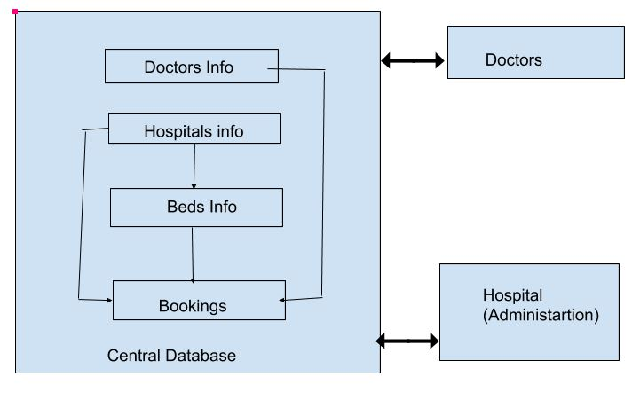

#       Web application for hospital data management and central collection

>Objective:

1. To have a proper digital system to schedule appointments by doctors.
2. To keep track of available beds,isolation units and ventilators in all hospitals.
3. To help the government identify shortage of medical facilities and equipment.

>Description:

Use of technology will help control the current epidemic. This software(web application) helps in data collection across all the hospitals in India involved in treating COVID-19 patients. The main aim is to help doctors schedule appointments for patients, help hospitals to provide isolation beds to patients and keep track of medical equipment into a central government database.This project will help doctors to check for available isolation beds in various hospitals and divert patients accordingly. Having a central database helps the government to check for shortages and make arrangements accordingly.The login ids to doctors and hospitals will be given by admin.

>Functionality:

1. Hospital Login
2. Doctor Login
3. Adding bed by hospital ( general,isolation,ventilator)
4. Editing Bed information ( hospital)
5. Booking a specific type of bed in a specific hospital. (Doctor)
6. Deleting booking.(Doctor)
7. Deleting Booking.( Hospital)
8. Deleting Bed.(hospital)
9. Summary of occupancy (Anyone)

>Software Requirements:

For server:

1) Python 3

2) Django 3.0.2 or higher

3) Web browser (Mozilla firefox 73.0 or higher) 

For clients ( Hospitals and Doctors):

Web Browser ( Mozilla firefox 73.0 or higher)

>Process Flow:

1. First, the patient will consult a doctor nearby who is having access to the system. The doctor after examining the patient will decide if the patient is to be sent for testing of COVID-19. If yes, the doctor will then book a general bed in the nearest hospital for the same patient.
2. After being tested if the result is positive the patient is shifted to an Isolation bed and the changes are uploaded on the website from the hospital side.
3. Also the administration will have the access to check if any hospital is going to run out of beds and plan further preparations.

>Data Flow Diagram: 

